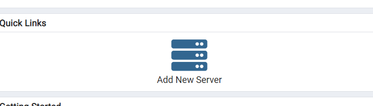
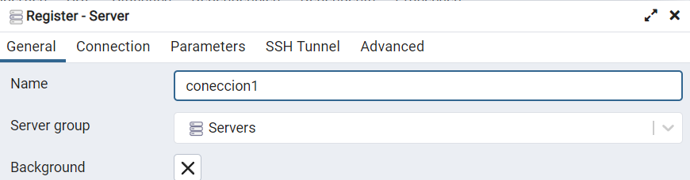
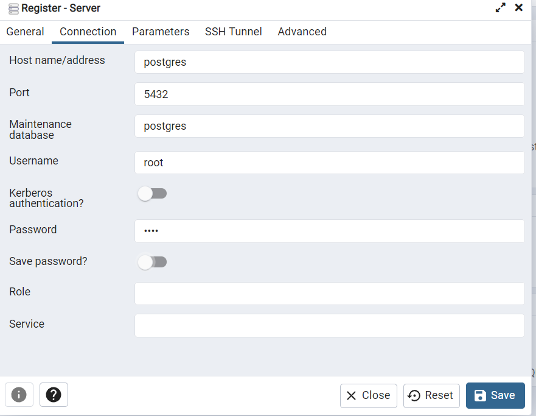
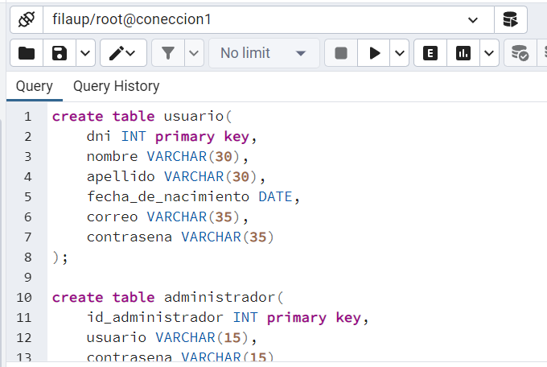

# Pasos para realizar

Cabe resaltar que este proceso solo se realizará una sola vez luego debera levantar el docker compose con el comando (docker-compose up) y ingresar con tus usuarios y contraseñas correspondientes.

1. Realizas un git clone del repositorio en tu terminal:
```bash
$ git clone https://github.com/JDiegox86/postgres-coneccion.git
```
2. Luego ingresar a la carpeta que se obtubo:
```bash
$ cd postgres-coneccion
```
3. Ahora listarás y deberias tener 2 archivos:
```bash
$ ls
$ base.sql            docker-compose.yml
```
4. Dentro de una terminal levantaras el docker-compose:
```bash
$ docker-compose up
```
5. Al ser iniciado el docker-compose colocarás en tu navegador web la siguiente:
```url
localhost:70
```
6. Si demorá debes esperar un poco 😅, posterior a esto te deberá aparecer la paginá de pgadmin4 y te solicitará un usuario y contraseña:
```
usuario: usuario@gmail.com
password: 1234
```
7. Luego de haber ingresado deberás crear un servidor.
* Dale click ahi


* Escribirás el nombre aqui:


* En la pestaña conecction agregarás los datos siguientes datos y guardarás con SAVE: 
* HOSTNAME: postgres
* PORT: 5432
* USERNAME: root
* PASSWORD: root


* Navegaras hasta llegar a las tablas (Servers)->(coneccion1)->(Databases)->(filaup)->(Schemas)->(Tables)

8. En tables esta vacío por ahora pero ingresaremos las tablas utilizando el archivo:
```
base.sql
```
* Copiaras todo el contenido este archivo y lo colocarás dentro de la vista querys presionada el 1 botón:


9. Por último pegarás todo el contenido del archivo (base.sql) y le darás en el botón de PLAY para generar estas tablas:
